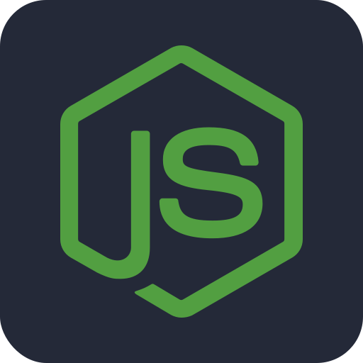
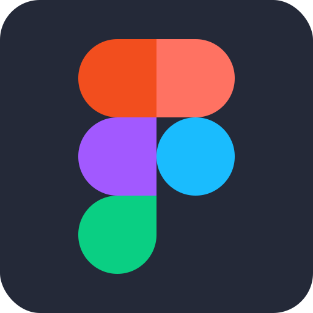

  

###

### `A young and passionate FullStack Developer from Spain!`

###

###

I'm an Indi FullStack Developer who just programs as a hobby. I'm now focused on finishing my studies, so I'm just doing personal projects. I like building functional stuff for end users or fellow Devs such as libraries and apps, but I'm also really interested in ML too!

I'm also a part time content creator on YouTube where I usually upload Minecraft related tutorials and on Twitch where you will often see me either gaming or coding.

###

 

  
  
  
  
  

###

 

---

<h2 align="center">🐍 Contributions 🐍</h3>

###

  

###

 

---

<h2 align="center">📊 My Stats 📊</h3>

###

 

  
  
  

 

---

###

<h2 align="center">📘 My Biggest Repos 📘</h3>

  
  
  
  
  

 

---

###

<h2 align="center">🛠️ Techs and Tools 🛠️</h3>

###

 

  
  
  
  
  
  
  
  
  
  
  
  
  
  
  

 

  
  
  
  
  
  
  
  
  
  
  
  
  
  
  
  
  

 

  
  
  
  
  
  
  
  
  
  
  
  
  
  
  

 

  
  
  
  
  
  
  
  
  
  
  
  
  
  
  
  
  

###

 

---

 

